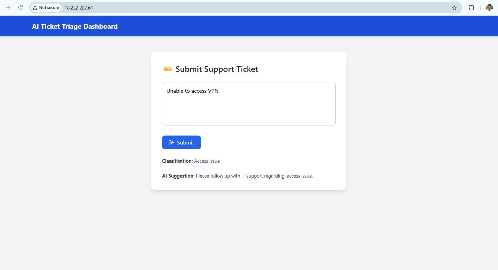

# 🧠 AI-Powered Knowledge Base & Ticket Auto-Triage System

This project uses AI to auto-classify IT support tickets and suggest categories using HuggingFace NLP models.

---

## 🚀 Features

- Real-time classification of support tickets
- HuggingFace Transformers (NLP)
- Flask REST API for classification
- React + Tailwind CSS frontend
- Deployed on AWS EC2 (Full Stack)

---

## 🛠️ Tech Stack

- **Frontend**: React, Tailwind CSS
- **Backend**: Flask (Python)
- **Model**: HuggingFace Transformers
- **Deployment**: AWS EC2
- **Other Tools**: Postman, GitHub

---

## 🖼️ Demo Screenshots

### 🎯 Dashboard UI
[(screenshots/flask console post request.png)]

---

## 🔧 Setup Instructions

```bash
# Backend
cd ai-ticket-triage/ai-service
source ../venv/bin/activate
python app.py

# Frontend
cd ai-ticket-triage/client
npm install
npm run build
sudo npx serve -s build -l 80

🌍 Live Access
Visit: http://18.222.227.61/

👨‍💻 Author
Dinesh Marthala
GitHub

yaml
Copy
Edit

---

### 📌 Save in Nano:

1. **Press** `Ctrl + O` → then `Enter` to save  
2. **Press** `Ctrl + X` to exit

---

### ✅ Then Push the Change:

```bash
git add README.md
git commit -m "Final README with clickable screenshots"
git push
