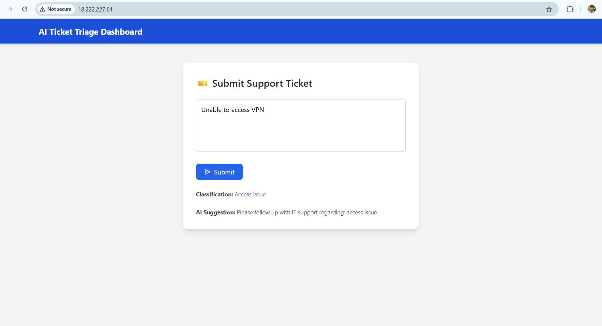
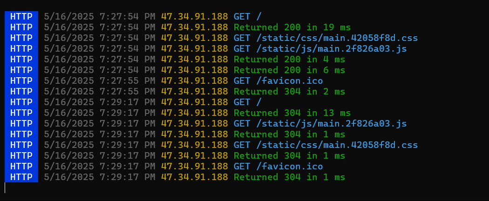

# 🧠 AI-Powered Knowledge Base & Ticket Auto-Triage System

This project uses AI to auto-classify IT support tickets and suggest categories using HuggingFace NLP models.

---

## 🚀 Features

- Real-time classification of support tickets
- HuggingFace Transformers (NLP)
- Flask REST API for classification
- React + Tailwind CSS frontend
- Deployed on AWS EC2 (Full Stack)

---

## 🛠️ Tech Stack

- **Frontend**: React, Tailwind CSS
- **Backend**: Flask (Python)
- **Model**: HuggingFace Transformers
- **Deployment**: AWS EC2
- **Other Tools**: Postman, GitHub

---

## 🖼️ Demo Screenshots

### 🎯 React Dashboard
[](screenshots/dashboard.png)

### 🔧 Flask Console Output
[](screenshots/flask-console.png)

---

### 🔗 Live Access

Visit: [http://18.222.227.61](http://18.222.227.61)

## 🔧 Setup Instructions

```bash
# Backend
cd ai-ticket-triage/ai-service
source ../venv/bin/activate
python app.py

# Frontend
cd ai-ticket-triage/client
npm install
npm run build
sudo npx serve -s build -l 80


👨‍💻 Author
Dinesh Marthala
GitHub


